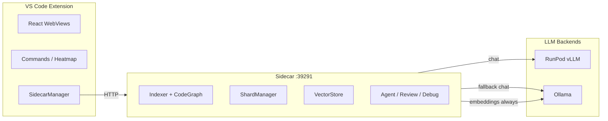

# NeuroCode

**Agentic coding for VS Code** — intelligent context shards, local or cloud LLMs, and a full agent loop on modest hardware.

[](https://github.com/ShahjahanAli/neurocode)
[](https://code.visualstudio.com/)
[](https://nodejs.org/)

NeuroCode is a VS Code extension that routes only the *relevant* parts of your codebase to an LLM before every agent call. It runs a local Node.js **sidecar** for indexing, embeddings, shard assembly, and orchestration, while the extension host handles the UI, editor integration, and diff review.

Primary backend: **vLLM on RunPod** (Qwen3-Coder). Automatic fallback: **Ollama** on your machine. Embeddings always stay local via Ollama (`nomic-embed-text`).

## About

NeuroCode is a **VS Code extension for agentic coding with local and cloud LLMs**. Instead of sending your whole repo to a model, it builds small **context shards** from the files that matter—active file, imports, callers, memory, and semantic matches—within a strict token budget.

Run **Qwen3-Coder on RunPod** when you want maximum quality, or **Ollama locally** when you want zero cloud cost. The extension includes chat, multi-step task planning, four-agent code review, causal debugging, project memory, and optional air-gap mode for offline environments.

---

## Why NeuroCode?

Most coding assistants stuff entire repos into context or depend on 32K+ context windows. NeuroCode takes a different approach:

1. **Shard architecture** — Assembles a small, ranked context pack (active file → imports → callers → memory → semantic matches) within a strict token budget (3.5K Ollama / 6K RunPod).
2. **Pluggable LLM routing** — Tries RunPod vLLM first, falls back to Ollama silently when the pod is offline.
3. **RunPod lifecycle** — Auto-start, warmup, idle auto-stop, and cost tracking so you only pay when coding.
4. **Acquisition-grade features** — Multi-agent review, project memory, causal debug, semantic drift detection, optional air-gap mode, and opt-in edit genome telemetry.

---

## Features

| Feature | Description |
|---------|-------------|
| **Overview hub** | Activity-bar landing page: model/index/pod status, active settings, and links to every feature |
| **Cursor-like Chat** | Natural-language chat on the **right sidebar** with Auto / Ask / Plan / Edit / Agent modes |
| **Intent routing** | Infers explain vs plan vs implement from conversation (history-aware, not keyword-only) |
| **Agent tool loop** | Agent mode: `read_file` → `search_code` → `write_file` → `reply` (Cursor-style) |
| **Auto-apply edits** | Implement mode writes files to the workspace when generation completes |
| **Auto-continue** | Cursor-style batch continuation for large / truncated file outputs |
| **Fix on check** | Checking an incomplete file auto-routes to implement and writes the fix |
| **Collapsible code cards** | Large code blocks collapse in chat; expand to view full file |
| **Ask Agent** | Single-turn coding tasks with shard-aware context and diff preview |
| **Shard Visualizer** | See exactly which files were sent to the LLM and why |
| **Task Queue** | Multi-step planner with DAG execution across up to 8 steps |
| **Code Review** | 4 parallel specialist agents (architect, security, performance, test) |
| **Project Memory** | Remembers accepted edits and boosts similar future context |
| **Causal Debug** | Stack trace → root cause analysis with gutter highlighting |
| **Attention Heatmap** | Gutter overlays showing in-context, cited, and missed lines |
| **RunPod Manager** | Start/stop pod, warmup, idle timeout, session cost report |
| **Air-Gap Mode** | Blocks external HTTP; Ollama-only for regulated environments |

---

## Architecture



**Three processes:**

- **Extension host** (TypeScript) — UI, commands, spawns sidecar, never calls LLMs directly
- **Sidecar** (Node.js) — indexing, SQLite, vectra, agent orchestration, REST API on `127.0.0.1:39291`
- **LLM backend** — RunPod vLLM and/or local Ollama

---

## Requirements

| Dependency | Version | Purpose |
|------------|---------|---------|
| [VS Code](https://code.visualstudio.com/) | ≥ 1.120 | Extension host |
| [Node.js](https://nodejs.org/) | ≥ 22.5 | Runs the sidecar child process |
| [Ollama](https://ollama.ai/) | latest | Fallback LLM + **all embeddings** |
| RunPod + vLLM | optional | Primary Qwen3-Coder backend |

### Ollama models (required)

```bash
ollama pull qwen2.5-coder:7b
ollama pull nomic-embed-text
```

---

## Quick Start

### 1. Clone and install

```bash
git clone https://github.com/ShahjahanAli/neurocode.git
cd neurocode
npm install
```

### 2. Build

```bash
npm run compile
```

This builds the React webview UI and bundles the extension to `dist/extension.js`.

### 3. Run in VS Code

1. Open the `neurocode` folder in VS Code.
2. Press **F5** to launch an **Extension Development Host**.
3. In the new window, open a project folder.
4. Run **NeuroCode: Index Project** from the Command Palette (`Ctrl+Shift+P`).
5. Press **Ctrl+Shift+A** to **Ask Agent**, or open **NeuroCode → Chat** on the **right sidebar** (Cursor-style).

### Chat modes (sidebar toolbar)

| Mode | What it does |
|------|----------------|
| **Auto** | Infers intent from natural language + conversation history (default) |
| **Ask** | Explain, review, discuss — no file writes |
| **Plan** | Multi-step JSON plan stored in SQLite |
| **Edit** | Generate code and apply to the project |
| **Agent** | Tool loop: read → search → write → reply, auto-applies files |

Talk naturally — e.g. `can you check service.ts`, `yes go ahead`, `handle auth end to end`. Social replies like `thanks` stay in Ask mode (no accidental writes).

### 4. Configure (Settings → search `neurocode`)

**Local only (Ollama):**

```json
{
  "neurocode.llm.provider": "ollama",
  "neurocode.llm.ollamaUrl": "http://localhost:11434",
  "neurocode.llm.ollamaModel": "qwen2.5-coder:7b",
  "neurocode.runpod.autoStart": false
}
```

**RunPod + vLLM (recommended for best quality):**

```json
{
  "neurocode.llm.provider": "vllm",
  "neurocode.llm.vllmUrl": "https://YOUR_POD_ID-8000.proxy.runpod.net/v1",
  "neurocode.llm.vllmApiKey": "YOUR_RUNPOD_API_KEY",
  "neurocode.llm.vllmModel": "Qwen/Qwen2.5-Coder-32B-Instruct-AWQ",
  "neurocode.runpod.apiKey": "YOUR_RUNPOD_API_KEY",
  "neurocode.runpod.podId": "YOUR_POD_ID",
  "neurocode.runpod.autoStart": true,
  "neurocode.runpod.autoStop": true,
  "neurocode.runpod.idleTimeoutMinutes": 30
}
```

Set `neurocode.shard.maxTokens` to `0` for automatic budgets (3500 Ollama / 6000 RunPod).

**Chat & agent settings:**

```json
{
  "neurocode.ui.chatLocation": "right",
  "neurocode.chat.mode": "auto",
  "neurocode.chat.autoApply": true,
  "neurocode.chat.autoContinue": true,
  "neurocode.chat.maxContinueRounds": 8,
  "neurocode.chat.fixOnCheck": true,
  "neurocode.chat.agentToolMaxSteps": 10,
  "neurocode.indexing.autoIndex": true
}
```

| Setting | Default | Description |
|---------|---------|-------------|
| `neurocode.ui.chatLocation` | `right` | Chat on secondary sidebar (Cursor) or `left` activity bar |
| `neurocode.chat.mode` | `auto` | Default mode when not using toolbar pills |
| `neurocode.chat.autoApply` | `true` | Write generated files without manual Accept |
| `neurocode.chat.autoContinue` | `true` | Continue truncated implement output automatically |
| `neurocode.chat.fixOnCheck` | `true` | Incomplete file + check/review → implement + write |
| `neurocode.chat.agentToolMaxSteps` | `10` | Max tool iterations per Agent mode request |

---

## Commands & Keybindings

| Command | Keybinding | Description |
|---------|------------|-------------|
| **NeuroCode: Ask Agent** | `Ctrl+Shift+A` | Single-turn agent with shard assembly |
| **NeuroCode: Review Code** | `Ctrl+Shift+R` | 4-agent parallel code review |
| **NeuroCode: Find Root Cause** | `Ctrl+Shift+D` | Causal debug from stack trace |
| **NeuroCode: Index Project** | — | Index workspace for shards & search |
| **NeuroCode: Plan Multi-Step Task** | — | Create an agent task DAG |
| **NeuroCode: Explain Context** | — | Preview shards without calling LLM |
| **NeuroCode: Start / Stop RunPod** | — | Manual pod lifecycle control |
| **NeuroCode: RunPod Cost Report** | — | Session cost history |
| **NeuroCode: Toggle Air-Gap Mode** | — | Enable offline-only operation |

Sidebar panels:

- **Right secondary sidebar (default):** **NeuroCode** tabbed panel — **Overview** | **Chat** | **Tasks** | **Shards** | **Review** | **Memory** | **Debug**
- **Left activity bar:** **Overview** (when chat is on left), **Tasks**, **Shards**, **Review**, **Memory**, **Debug**

Set `neurocode.ui.chatLocation` to `left` to dock Chat with the other panels.

---

## Project Layout

```
neurocode/
├── src/                 # VS Code extension (TypeScript)
│   ├── extension.ts     # Activation, status bar, webview registration
│   ├── commands/        # Command handlers
│   ├── panels/          # WebView providers
│   ├── editor/          # Attention heatmap
│   └── sidecar/         # SidecarManager + HTTP client
├── webview-ui/          # React sidebar UI (Vite)
│   └── src/components/  # CollapsibleCodeBlock, MessageMarkdown, …
├── sidecar/             # Node.js agent server (port 39291)
│   ├── server.js
│   ├── core/            # ShardManager, ChatOrchestrator, IntentResolver,
│   │                    # AgentToolLoop, AgentTools, FileReview, …
│   ├── routes/          # REST + SSE API
│   └── db/              # SQLite schema
├── media/               # Icons and gutter assets
├── BLUEPRINT.md         # Full architecture guide
├── CURSOR_PROMPTS.md    # Step-by-step build playbook
└── README-ENTERPRISE.md # Docker, Helm, team deployment
```

Indexing data is stored per project in `.neurocode/` (gitignored by default via `.neurocodeignore`).

---

## Development

```bash
# Watch mode (extension + typecheck)
npm run watch

# Webview only
npm run build:webview

# Lint + typecheck
npm run lint
npm run check-types

# Test RunPod connectivity
VLLM_URL="https://..." VLLM_KEY="..." VLLM_MODEL="..." node sidecar/scripts/test-runpod.js
```

### Debugging

- **F5** — launches Extension Development Host with preLaunch build.
- **Output → NeuroCode** — sidecar stdout/stderr logs.
- Sidecar health: `curl http://127.0.0.1:39291/health`

---

## Enterprise & Team Deployment

See [README-ENTERPRISE.md](./README-ENTERPRISE.md) for Docker Compose, Kubernetes Helm charts, air-gap deployment, and cost tuning.

```bash
docker compose up -d   # shared sidecar + Ollama
```

---

## Publishing to the VS Code Marketplace

NeuroCode can be published so users can install it from the Extensions view:

```bash
npm install -g @vscode/vsce
npm run package
vsce package
vsce publish   # requires publisher account matching package.json "publisher"
```

Before publishing, ensure `sidecar/node_modules` is included in the `.vsix` (adjust `.vscodeignore` if needed), add a `LICENSE`, marketplace icon (128×128 PNG), and a complete README.

---

## Troubleshooting

| Problem | Solution |
|---------|----------|
| Status bar shows **Sidecar failed** | Confirm Node.js 22.5+ is on your PATH; check **Output → NeuroCode** |
| No semantic search / empty shards | Ensure Ollama is running and `nomic-embed-text` is pulled |
| RunPod not connecting | Verify `vllmUrl` ends with `/v1`; test with `sidecar/scripts/test-runpod.js` |
| **Chat stream ended without a response** | Reload extension; check RunPod URL/key; read the real error (fixed in latest build) |
| Chat wrote files after `thanks` | Update extension — social acks no longer trigger implement |
| Blank sidebar panels | Run `npm run compile` to build `webview-ui/dist/` |
| Chat not on right | Set `neurocode.ui.chatLocation` to `right` and reload window |
| Port in use | Change `neurocode.sidecar.port` (default `39291`) |

---

## Documentation

- [BLUEPRINT.md](./BLUEPRINT.md) — Architecture and API contract
- [QUICK_REFERENCE.md](./QUICK_REFERENCE.md) — Chat modes, token budgets, API, settings
- [CHANGELOG.md](./CHANGELOG.md) — Release history
- [CURSOR_PROMPTS.md](./CURSOR_PROMPTS.md) — Phased implementation guide
- [.cursorrules](./.cursorrules) — Project conventions for contributors and AI agents

---

## Contributing

Contributions are welcome. Please open an issue before large changes. Follow the conventions in `.cursorrules` and the build order in `CURSOR_PROMPTS.md`.

1. Fork the repository
2. Create a feature branch (`git checkout -b feature/my-change`)
3. Run `npm run compile` and ensure it passes
4. Open a pull request with a clear description

---

## Author

Built by **[Shahjahan Ali](https://github.com/ShahjahanAli)** · [ZMS Digital Solutions](https://github.com/ShahjahanAli) · Dhaka, Bangladesh

Related work: [HyperZ](https://github.com/ShahjahanAli/HyperZ) (AI-native enterprise SaaS framework)

---

## License

MIT © 2026 [Shahjahan Ali](https://github.com/ShahjahanAli) / ZMS Digital Solutions — see [LICENSE](./LICENSE).
