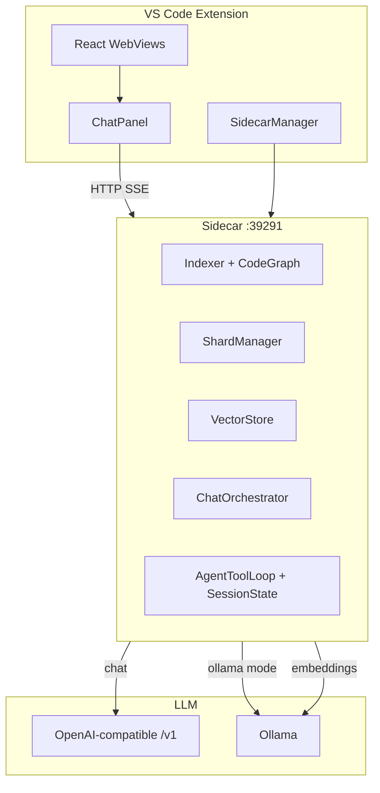

# NeuroCode

**Shard-orchestrated agentic coding for VS Code** — run capable coding agents on modest hardware, any OpenAI-compatible LLM, and full operational control.

[](https://code.visualstudio.com/)
[](https://nodejs.org/)
[](./LICENSE)

NeuroCode is a VS Code extension that **thinks before it calls the model**. A local Node.js sidecar indexes your project, builds ranked **context shards**, and runs multi-step agent loops — while the extension host handles UI, editor integration, and safe file application.

Use **any OpenAI-compatible gateway** (LiteLLM, vLLM, RunPod proxy, OpenRouter, OpenAI) or **Ollama** locally. Embeddings stay on-device via Ollama (`nomic-embed-text`) for semantic search and drift detection.

---

## Table of contents

- [Why NeuroCode](#why-neurocode)
- [How it works](#how-it-works)
- [Features](#features)
- [Requirements](#requirements)
- [Quick start](#quick-start)
- [Configuration](#configuration)
- [Chat & agent modes](#chat--agent-modes)
- [Architecture](#architecture)
- [Commands](#commands)
- [Project layout](#project-layout)
- [Development](#development)
- [Troubleshooting](#troubleshooting)
- [Documentation](#documentation)
- [Contributing](#contributing)
- [License](#license)

---

## Why NeuroCode

Most assistants optimize for **giant context windows** and proprietary indexing. NeuroCode optimizes for **small, explainable context** and **deployability**:

| Principle | What it means |
|-----------|----------------|
| **Shard-first** | Only relevant files reach the LLM, ranked by priority and capped by token budget |
| **Local brain** | Indexing, dependency graph, embeddings, and orchestration run in a sidecar you control |
| **Pluggable LLM** | One config surface (`apiBaseUrl`, `apiKey`, `model`) — no vendor lock-in |
| **Bounded agent memory** | Agent steps rebuild a fixed-size prompt from session state — tokens stay flat across steps |
| **Safe writes** | Tool-loop edits go through staged `write_file` / `search_replace`; tool JSON is blocked from disk |
| **Air-gap ready** | Enforce Ollama-only operation for regulated environments |

---

## How it works

```
You send a message (Auto / Ask / Plan / Edit / Agent)
        │
        ▼
Sidecar indexes & assembles shards (or seeds paths from stack traces)
        │
        ▼
LLM router (Auto) or mode pill picks execution path
        │
        ├── Ask / Plan / Edit  →  single-stream chat with shard context
        │
        └── Auto / Agent       →  AgentToolLoop
                │
                ├── read_file / search_code  (sidecar disk + vectors)
                ├── search_replace           (minimal line-level edits)
                ├── write_file               (full file, when necessary)
                └── reply                    (done)
        │
        ▼
Extension applies staged writes (with validation) or shows diff review
```

**Agent session model:** Full file contents live in the sidecar session cache. Each LLM step receives a **rebuilt prompt** — task, short session log, and up to three file previews (~1.2k chars each) — so input tokens stay ~2–4k per step instead of growing linearly.

---

## Features

| Area | Capability |
|------|------------|
| **Chat** | Cursor-style sidebar: Auto, Ask, Plan, Edit, Agent; model Auto/Manual; file attachments |
| **Agent loop** | `read_file`, `search_code`, `search_replace`, `write_file`, `reply` via fenced `neurocode-tool` blocks |
| **Intent routing** | LLM-first router in Auto mode (`neurocode.chat.intentRouter: llm`) with `seed_paths` from errors |
| **Shards** | Visualizer shows every file sent, reason tag, and token count |
| **Change review** | Accept / Reject per file, diff editor, Accept All |
| **Planning** | Multi-step DAG stored in SQLite; optional agent execution |
| **Code review** | Four parallel specialists (architect, security, performance, test) |
| **Memory & drift** | Project memory graph; semantic drift alerts after commits |
| **Debug** | Causal stack-trace analysis; attention heatmap in the gutter |
| **Analytics** | Per-response tokens, latency, thumbs up/down |
| **Enterprise** | Air-gap mode, optional RunPod lifecycle, Docker/K8s — see [README-ENTERPRISE.md](./README-ENTERPRISE.md) |

---

## Requirements

| Dependency | Version | Purpose |
|------------|---------|---------|
| [VS Code](https://code.visualstudio.com/) | ≥ 1.120 | Extension host |
| [Node.js](https://nodejs.org/) | ≥ 22.5 | Sidecar child process |
| [Ollama](https://ollama.ai/) | latest | Embeddings + local LLM mode |
| OpenAI-compatible gateway | optional | Cloud or self-hosted chat models |

```bash
ollama pull qwen2.5-coder:7b
ollama pull nomic-embed-text
```

---

## Quick start

```bash
git clone https://github.com/ShahjahanAli/neurocode.git
cd neurocode
npm install
npm run compile
```

1. Open the repo in VS Code and press **F5** (Extension Development Host).
2. Open a project folder in the new window.
3. Run **NeuroCode: Index Project** (`Ctrl+Shift+P`).
4. Open **NeuroCode → Chat** on the right sidebar, or press **Ctrl+Shift+A**.

Configure your LLM under **Settings → `neurocode`** (see [Configuration](#configuration)).

---

## Configuration

### Local only (Ollama)

```json
{
  "neurocode.llm.mode": "ollama",
  "neurocode.llm.ollamaUrl": "http://localhost:11434",
  "neurocode.llm.ollamaModel": "qwen2.5-coder:7b"
}
```

### OpenAI-compatible gateway (recommended)

```json
{
  "neurocode.llm.mode": "gateway",
  "neurocode.llm.apiBaseUrl": "https://your-gateway.example.com/v1",
  "neurocode.llm.apiKey": "your-bearer-token",
  "neurocode.llm.model": "qwen/qwen3-coder",
  "neurocode.llm.modelSelection": "auto",
  "neurocode.llm.maxOutputTokens": 4096,
  "neurocode.llm.fallbackToOllama": false
}
```

### Chat & agent (recommended defaults)

```json
{
  "neurocode.ui.chatLocation": "right",
  "neurocode.chat.mode": "auto",
  "neurocode.chat.intentRouter": "llm",
  "neurocode.chat.autoApply": true,
  "neurocode.chat.autoContinue": true,
  "neurocode.chat.fixOnCheck": true,
  "neurocode.chat.agentToolMaxSteps": 8,
  "neurocode.chat.maxAttachments": 5,
  "neurocode.shard.maxTokens": 0,
  "neurocode.indexing.autoIndex": true
}
```

| Setting | Default | Description |
|---------|---------|-------------|
| `neurocode.llm.mode` | `gateway` | `gateway` or `ollama` |
| `neurocode.llm.maxOutputTokens` | `2048` | Max completion tokens per LLM call; use `4096` for agent `write_file` |
| `neurocode.chat.intentRouter` | `llm` | Auto mode routing: `llm` (recommended), `hybrid`, or `heuristic` |
| `neurocode.chat.autoApply` | `true` | Apply staged agent writes and implement-mode code blocks |
| `neurocode.chat.agentToolMaxSteps` | `10` | Max tool iterations per agent request |
| `neurocode.shard.maxTokens` | `0` | `0` = auto budget (3500 Ollama / 6000 gateway) |

Legacy keys (`vllmUrl`, `openaiUrl`, `provider`) map to the unified LLM settings automatically.

---

## Chat & agent modes

| Mode | Behavior | Writes files? |
|------|----------|---------------|
| **Auto** | LLM router → agent tool loop; reads stack traces; `search_replace` for small fixes | When router allows writes |
| **Ask** | Explain / review; investigate loop (read-only tools) | No |
| **Plan** | JSON task DAG in SQLite | No (until you execute steps) |
| **Edit** | Shard-aware implement stream + optional auto-continue | Yes if `autoApply` |
| **Agent** | Full tool loop with higher step budget | Yes if `autoApply` |

**Model picker** (Auto vs Manual) is separate from chat mode Auto — it selects which model id the gateway uses.

### Agent tools

Respond with one fenced block per turn:

```neurocode-tool
{"tool":"search_replace","args":{"path":"app/page.tsx","old_text":"...","new_text":"..."}}
```

| Tool | Purpose |
|------|---------|
| `read_file` | Read project file (max ~6k chars per call) |
| `search_code` | Semantic + path search via local index |
| `search_replace` | **Preferred** for line-level fixes (low token cost) |
| `write_file` | Full file rewrite when most of the file changes |
| `reply` | End loop with a user-facing summary |

### Write safety

- Agent tool-loop responses are **not** parsed as markdown code blocks for auto-apply.
- Staged content is validated — tool-call JSON and truncated files are rejected before disk write.
- Use **git** to recover if a file was corrupted by an older build: `git checkout -- path/to/file`.

---

## Architecture



**Three processes:** extension host (UI + `vscode.workspace.fs`), sidecar (heavy logic + SQLite + vectra), LLM backend (pluggable).

---

## Commands

| Command | Key | Description |
|---------|-----|-------------|
| NeuroCode: Ask Agent | `Ctrl+Shift+A` | Shard-aware single-turn ask |
| NeuroCode: Review Code | `Ctrl+Shift+R` | Four-agent parallel review |
| NeuroCode: Find Root Cause | `Ctrl+Shift+D` | Causal debug from stack trace |
| NeuroCode: Index Project | — | Build index for shards & search |
| NeuroCode: Plan Multi-Step Task | — | Create task DAG |
| NeuroCode: Toggle Air-Gap Mode | — | Ollama-only enforced |

**Sidebar tabs:** Overview · Chat · Analytics · Tasks · Shards · Review · Memory · Drift · Genome · Debug

---

## Project layout

```
neurocode/
├── src/              Extension host (TypeScript)
├── webview-ui/       React sidebar (Vite)
├── sidecar/          Node agent server (:39291)
│   └── core/         ShardManager, ChatOrchestrator, AgentToolLoop, IntentRouter, …
├── BLUEPRINT.md      Architecture & API contract
├── QUICK_REFERENCE.md
└── CHANGELOG.md
```

Per-project index data: `.neurocode/` (local, gitignored by default).

---

## Development

```bash
npm run watch          # Extension watch build
npm run build:webview  # Webview only
npm run lint && npm run check-types
curl http://127.0.0.1:39291/health
```

Press **F5** to launch the Extension Development Host. After sidecar changes, **reload the window** so the child process restarts.

---

## Troubleshooting

| Problem | What to do |
|---------|------------|
| Sidecar failed | Node 22.5+ on PATH; check **Output → NeuroCode** |
| Empty shards / search | Ollama running; `ollama pull nomic-embed-text` |
| Gateway errors | `apiBaseUrl` must end with `/v1`; test `GET /v1/models` |
| Agent hits output limit | Raise `neurocode.llm.maxOutputTokens` to `4096`; prefer `search_replace` |
| High input tokens per step | Reload after update — session rebuild should keep ~2–4k flat |
| File contains `{"tool":"write_file"...` | Corrupted by older build — `git checkout -- <file>` then retry |
| Chat stream ended without response | Reload extension; verify gateway key and sidecar health |
| Port in use | Change `neurocode.sidecar.port` (default `39291`) |

---

## Documentation

| Document | Contents |
|----------|----------|
| [BLUEPRINT.md](./BLUEPRINT.md) | Full architecture, API contract, build order |
| [QUICK_REFERENCE.md](./QUICK_REFERENCE.md) | Modes, tools, settings, token budgets |
| [CHANGELOG.md](./CHANGELOG.md) | Release history |
| [README-ENTERPRISE.md](./README-ENTERPRISE.md) | Docker, Helm, air-gap deployment |
| [CURSOR_PROMPTS.md](./CURSOR_PROMPTS.md) | Phased implementation guide |
| [.cursorrules](./.cursorrules) | Contributor & AI agent conventions |

---

## Contributing

1. Fork the repository and create a feature branch.
2. Follow conventions in `.cursorrules`.
3. Run `npm run compile` before opening a PR.
4. Open an issue before large architectural changes.

---

## Author

**[Shahjahan Ali](https://github.com/ShahjahanAli)** · ZMS Digital Solutions · Dhaka, Bangladesh

Related: [HyperZ](https://github.com/ShahjahanAli/HyperZ) — AI-native enterprise SaaS framework

---

## License

MIT © 2026 [Shahjahan Ali](https://github.com/ShahjahanAli) / ZMS Digital Solutions — see [LICENSE](./LICENSE).
